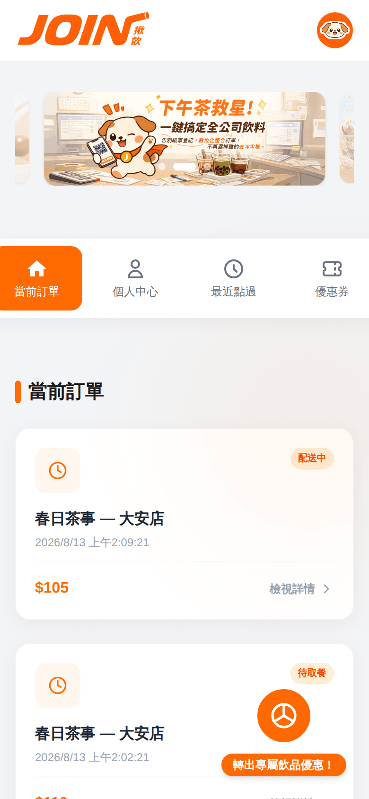
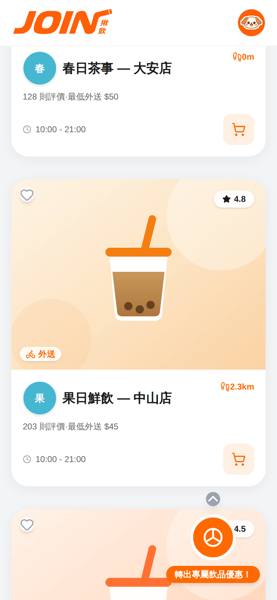
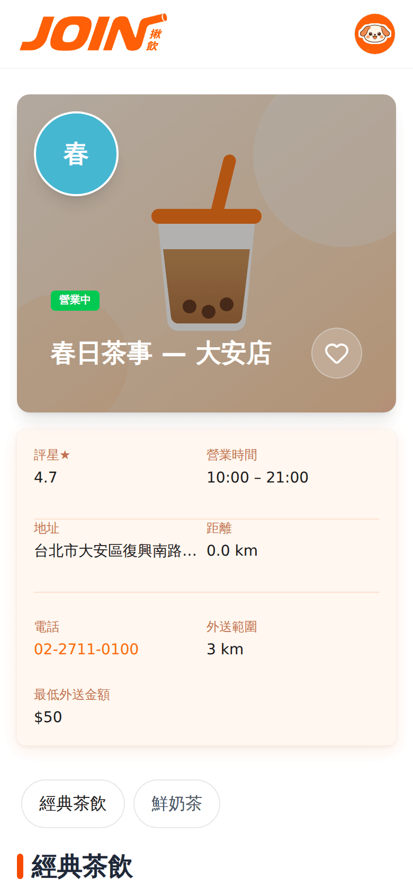
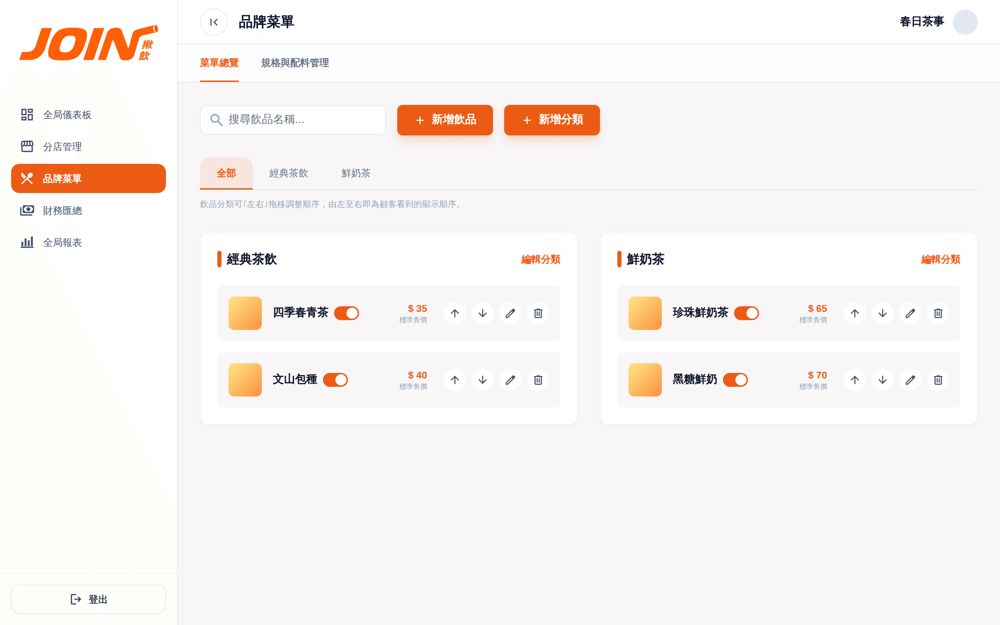
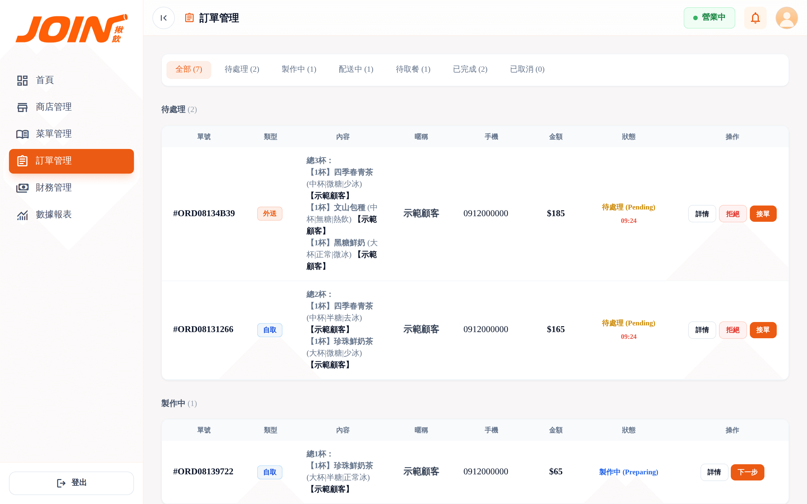

# JoinDrink

多租戶飲料訂購與**揪團**平台。顧客可以自己下單，也可以開一個揪團連結讓同事朋友各自加點、由團長統一結帳；
品牌總部管理菜單與跨店財務，門市端處理接單與庫存。

**Spring Boot 3.4.3 / Java 17 · MySQL 8 · Redis 7 · WebSocket(STOMP) · JWT**

[](https://github.com/Leo0049/projectLab_2/actions/workflows/ci.yml)

---

## 30 秒把它跑起來

```bash
docker compose up -d      # MySQL 8 + Redis 7
mvn spring-boot:run       # 服務起在 :8082
```

不需要任何額外設定：`application.yml` 每一項都有對應本機 Docker 的預設值，
首次啟動會自動建表並植入**示範資料**（2 個品牌、3 間門市、6 款飲品、1 個顧客帳號，
以及 7 筆橫跨待處理／製作中／配送中／待取餐／已完成的訂單，讓門市後台一開就有東西可看）。

開 http://localhost:8082/swagger-ui.html 看 API，或用下列帳號登入前端頁面
（`frontend/` 為靜態頁，用 VS Code Live Server 之類的工具開啟即可）：

| 角色 | 帳號 | 密碼 |
|------|------|------|
| 顧客 | `0912000000` | `demo1234` |
| 品牌總部 | `demo_brand` | `demo1234` |
| 門市 | `demo_store` | `demo1234` |

> 示範資料只在資料表為空時植入，不會覆蓋既有資料；正式環境請設 `DEMO_DATA_ENABLED=false`。

---

## 功能範圍

| 模組 | 內容 |
|------|------|
| **揪團訂單** | 建立揪團 → 產生分享 token → 成員各自加點 → 團長統一送出、補款/退款 |
| **錢包與帳本** | 儲值、下單扣款、團長代墊託管、取消／拒單退款、團員補款，全部進同一份帳本 |
| **多租戶菜單** | 品牌層級的飲品模板、甜度/冰量/杯型規格、加料設定，門市可覆蓋供應狀態 |
| **區域定價** | 同品牌不同地區可設定各自的分類加價 |
| **即時推播** | WebSocket/STOMP 推送訂單狀態與揪團品項異動 |
| **優惠券轉盤** | 每日抽獎，優惠券圖片由 Java 2D 動態生成後上傳 Cloudinary |
| **商品快照** | 下單時保存當下品名與價格，日後改價不影響歷史訂單 |

規模：後端 144 個檔案 / 約 15.2k 行，26 張資料表，14 個 REST controller；前端 39 個頁面、約 17.8k 行 JS（Vanilla JS + Tailwind）。

---

## 畫面

以下都是照著「30 秒把它跑起來」啟動後的實際畫面，資料來自內建示範資料，沒有另外做假圖。

| 顧客首頁 | 附近店家 | 店家與菜單 |
|---|---|---|
|  |  |  |
| 進行中訂單、活動輪播、每日轉盤入口 | 依距離排序，含評分、外送門檻與營業時間 | 店家資訊與分類菜單 |

| 品牌總部 — 菜單管理 | 門市後台 — 訂單管理 |
|---|---|
|  |  |
| 分類與飲品排序、上下架、售價維護 | 依狀態分區，接單／拒單／製作完成的完整流轉 |

> 店家與飲品圖片是專案內建的 SVG 示意圖，不依賴任何外部圖床，離線也能完整展示。

---

## 架構

```
Customer / Brand / Store 三種前台 (Vanilla JS)
                │  Bearer JWT
                ▼
      ┌──────────────────────┐
      │  Spring Security 6   │  JwtAuthenticationFilter → currentUserId
      │  + STOMP 攔截器       │  CONNECT 驗 JWT、SUBSCRIBE 驗訂單關係人
      └──────────┬───────────┘
                 ▼
   14 Controllers → 26 Services → 28 Repositories
                 │                      │
                 ▼                      ▼
          Redis 7                   MySQL 8
   揪團購物車 / 分散式鎖 / 轉盤狀態      26 張表（JPA Entity 為 schema 唯一事實來源）
```

三種角色 `CUSTOMER` / `BRAND` / `STORE`，授權規則集中在 `SecurityConfig`。

---

## 安全稽核與修補

專案完成後對**執行中的系統**做了一輪黑箱與白箱並行的稽核，
所有問題都以實際請求重現、並用資料庫狀態確認，修補後再重跑同一組驗證。

| # | 問題 | 實測影響 | 修補 |
|---|------|---------|------|
| S-1 | `POST /api/products` 落在整段 `permitAll`，且直接綁定 JPA 實體 | 未登入即可新增商品；因 `save()` 的 merge 語意帶入既有 `id` 可竄改他人商品，**實測把售價 65.00 改成 0.01** | 移除該冗餘端點；`permitAll` 一律改為只放行 `HttpMethod.GET` 的具體路徑 |
| S-2 | 擁有權檢查寫成 `if (authUserId != null && ...)`，而 `authUserId` 是用戶端自送的選填參數 | 不帶該參數即可跳過檢查，**實測把他人餘額改成 99999** | 改用 filter 注入的 `currentUserId`，10 個端點統一走 `requireSelf()` |
| S-3 | 同一成因造成一批讀取端點缺少擁有權檢查 | 可讀取他人姓名、手機號碼與餘額 | 同上 |
| S-4 | 兩個 debug 端點位於 `permitAll` 路徑下 | 未認證即可取得他人手機號碼；另一支會回傳完整 stack trace | 移除 |
| S-5 | WebSocket 為 `allowedOriginPatterns("*")` 且無任何 STOMP 攔截器 | `orderId` 是連續整數可列舉，任何人可旁觀他人訂單狀態 | CONNECT 驗 JWT、SUBSCRIBE 驗訂單關係人；origin 收斂為與 HTTP 共用的白名單 |
| S-6 | `OrderController` 整支沒有任何擁有權檢查：訂單列表吃路徑上的 `userId`，狀態／取消端點則是 `if (userId != null) 檢查 else 放行` | 任一登入顧客可讀他人完整訂單歷史（金額、品項、揪團 `shareToken`）；**不帶 `userId` 參數即可把他人訂單從 READY 改成 COMPLETED**；`/api/orders/store/{id}` 還能撈出整間門市訂單，含其他顧客的外送地址 | 全部改用 filter 注入的 `currentUserId`，移除「不帶參數就跳過」的分支；門市傾印端點刪除（門市請用有分頁、有 STORE 權限的 `/api/stores/orders`） |
| D-1 | 餘額為「讀出→相加→寫回」且無列鎖 | 20 個併發各儲值 10 元，**最終只入帳 70 元，且帳本總額 120 與餘額 70 對不起來** | 改用 `SELECT ... FOR UPDATE`；所有金流都收斂在 `updateStoreCredit()` 一個進入點 |
| D-4 | 優惠券的消耗是「先讀出檢查 `status == unused`，再寫回 `used`」的 read-check-write | 兩個品項同時套用同一張券，**兩邊都拿到折扣**——一張券折了兩次 | 改為原子的 `UPDATE ... WHERE status = 'unused'`，受影響列數為 0 即代表已被用掉並擋下；且在動品項**之前**先消耗 |
| D-2 | 四條金流路徑都是「讀出品項 → 動錢 → 改狀態」的 read-modify-write，全部沒有列鎖 | 以 8 個併發請求實測（金額都應該只發生一次 $35）：<br>團員結帳 → 帳本 5 筆 −35（−175）而餘額只掉 35，**差 5 倍**<br>團長結帳 → 8 個全部成功，**被扣 8 次**<br>補款給團長 → **扣了 175**<br>取消退款 → escrow **退了 280** | 品項與揪團該列一律改用 `PESSIMISTIC_WRITE` 鎖定讀（`findByGroupOrderAndUserAndStatusForUpdate` / `findByShareTokenForUpdate` / `findByIdForUpdate`），結帳另加狀態守衛 |
| S-7 | `POST /api/orders/checkout`（顧客結帳頁真正打的端點）身分與成交價**都取自 request body** | 把 `userId` 換成別人的即可**拿他人錢包付自己的訂單**（實測受害者餘額 19255 → 19220，攻擊者餘額 0 不變）；把 `finalPrice` 送成 1 則能**用 $1 買走 $35 的飲料** | 身分改用 filter 注入的 `currentUserId`（連同 `saveOrUpdateUserAddress` 一起）；金額改由 `OrderService.repriceItems()` 依資料庫重算，公式收斂到 `PricingService`（底價＋區域加價＋配料加價），快照欄位一律由伺服器決定 |
| S-8 | `UserFavoriteController` 三支端點的 userId 分別取自路徑、查詢參數與 request body，全都沒有擁有權檢查 | 任一登入顧客可讀取他人的收藏清單、查詢他人是否收藏某店，並用他人的 `userId` 呼叫 toggle——**實測把受害者收藏的店家直接取消掉** | 三支一律改用 filter 注入的 `currentUserId`，讀取端點加 `requireSelf()` |
| S-9 | 消耗優惠券的 `UPDATE` 只比對 `id` 與 `status`，沒有比對擁有者；`apply-coupon` 端點又完全不看 token；`GET /api/coupons/user/{userId}` 與 `/{id}` 也沒有擁有權檢查 | `user_coupons.id` 是連續整數，**實測把受害者的 couponId 套到自己的品項上：對方的券變成 `used`，折扣算在攻擊者頭上**（偷券）| 擁有者一併寫進 `WHERE`（與狀態同一個原子操作）；三支端點的身分一律改取自 token，單張查詢的擁有權檢查放在 Service 的交易內 |
| D-3 | `findByIdForUpdate` 取得了列鎖，回傳的卻是一級快取裡「上鎖之前」的 User | 呼叫端只要在扣款前讀過同一個 User（揪團結帳會先碰 `item.getUser()`），列鎖就被架空，併發時每個交易用同一個舊餘額計算，最後一個寫入獲勝 | 在持鎖狀態下以 `refresh(user, PESSIMISTIC_WRITE)` 重讀。**不能用普通 `refresh()`**：MySQL 預設 REPEATABLE READ 之下普通 SELECT 讀的是交易快照，回來還是舊值——這一版修補是被測試打回來才改對的 |

另外修掉幾個會直接影響可用性的問題：

- **登入必定 500**：`signWith(alg, String)` 會將 secret 做 Base64 解碼，預設值解碼後只剩 416 bits，不符 HS512 要求。改用原始位元組建立金鑰，並把長度檢查移到啟動時，不足即啟動失敗。
- **`jwt.expiration` 完全不生效**：`JwtUtils` 寫死 7 天，設定檔的 24h 從未套用。
- **用戶端錯誤一律回 500**：路由不存在、缺參數、型別錯全部落入 catch-all；且原始例外訊息（含 DB 結構）會回傳給前端。現已分流為 404/400/405，內部細節只寫入 log。
- **`open-in-view: false` 之下的固定 500**：關閉 OSIV 後，交易外碰到 LAZY 關聯就會拋 `LazyInitializationException`。這類錯誤在單元測試看不到、要實際打端點才會現形，前後共出現在十個地方——其中 `GET /api/stores/settings/profile` 是門市後台**每一頁的頁首**都會呼叫的，壞掉時整個後台的營業狀態永遠停在「讀取中…」。另兩個公開端點直接回傳 JPA entity，Jackson 序列化 `brand` / `region` proxy 時必定 500。修法統一為「在交易內轉成純 Map 再回傳」，並用一支涵蓋 45 個 GET 端點的普掃確認歸零。

帳本本身也整理過。`transaction_records.type` 一度被當成顯示字串，實際存的是
`"消費扣款\n個人訂單 #12 結帳扣款"` 這種兩行文字，前端再自己 split、用 `includes('補款')`
之類的比對推回種類——連「按種類統計」都得寫 `SUBSTRING_INDEX(type,'\n',1)`。
現已拆成 `type`（固定 token）與 `description`（說明）兩欄，判斷邏輯收在純函式
`TxDisplay.normalize()`（舊資料照樣拆得回來），前端只負責畫。
順帶修掉兩個對帳上的小洞：扣款發生在訂單 persist 之前，說明固定寫成「個人訂單 # 結帳扣款」，
**52 筆全都對不回是哪一張單**；以及 `GET /api/wallet/transactions` 把整份帳本撈進記憶體再
`subList` 切頁——查十筆卻讀了全部，和 `/api/stores/orders` 當初那個問題一模一樣。

> 這輪普掃也順手抓到前端的一個對稱問題：門市訂單頁用 `''` 當「上次資料快照」的初始值，
> 而空清單算出來的快照剛好也是 `''`，於是**零筆訂單時第一次載入會被判定成「資料沒變」而不重繪**，
> 六個區塊永遠停在「載入中…」——剛 clone 下來、還沒有任何訂單的人看到的就是這個畫面。

> 稽核與修補過程使用 Claude Code 協助進行。

---

## 測試

```bash
docker compose up -d && mvn test
```

| 測試 | 守住的東西 |
|------|-----------|
| `AuthorizationTest`（18） | 未認證寫商品、跨帳號讀寫個資／錢包／訂單／收藏、偽造參數與「不帶參數」兩種繞過、拿他人 `userId` 結帳、竄改 `finalPrice`、消耗他人優惠券、debug 與傾印端點已移除、本人存取仍正常 |
| `ItemSpecResolverTest`（7） | 固定規格防竄改：商品只有唯一規格選項時不採信用戶端送來的值 |
| `ItemHashTest`（6） | 品項識別碼：配料順序不影響合併、任一規格不同即分開、套券的那杯要拆出來 |
| `CouponEligibilityTest`（6） | 優惠券適用範圍：跨品牌／跨商品要擋、已付款不可再套 |
| `TxDisplayTest`（7） | 帳本種類正規化：舊的「標題\n說明」格式要拆回 type／description、補款靠正負號分辨收付方 |
| `ImageStorageServiceTest`（4） | 無 Cloudinary 憑證時改走本機儲存、同 id 覆寫、可疑副檔名正規化 |
| `WalletConcurrencyTest`（3） | 併發儲值不短少、帳本與餘額相符、併發扣款不透支、列鎖不被一級快取架空 |
| `GroupCheckoutConcurrencyTest`（6） | 揪團的四條金流路徑（團員結帳、團長結帳、補款、取消退款）重複觸發時同一筆金額只能發生一次、帳本與餘額必須相符；同一張優惠券不可被用兩次 |
| `DemoApplicationTests`（1） | Spring context 載入 |

`ItemSpecResolverTest` / `ItemHashTest` / `CouponEligibilityTest` / `TxDisplayTest` 是純邏輯測試，
不載入 Spring context，58 個測試裡它們合計只跑 0.1 秒。
能這樣測是因為先把規則從 `GroupOrderService` 抽了出來——見下方「拆出可測試的規則」。

測試不多，但都對準真正會出事的地方（金流與授權），而且**每一支都驗證過「把修補改回舊寫法時會失敗」**——
授權測試在還原 IDOR 邏輯時 3 個失敗、還原 S-6 時 2 個失敗，錢包測試在改回 `findById` 時 2 個失敗，
規格測試在把防竄改改回「照單全收」時 4 個失敗，揪團金流測試在拿掉任一條路徑的列鎖時對應的那個失敗。

> 這裡有個值得記下來的細節：取消退款那條，**真正擋住重複退款的是列鎖，不是狀態守衛**——
> 實測只拿掉列鎖、留著「已取消就 return」的守衛，escrow 仍然退了 140 而不是 35，
> 因為沒有鎖時讀到的狀態本身就是舊的。守衛留著是為了讓意圖明確，但它不是那道防線。
只在修補後跑一次通過的測試，證明不了它擋得住回歸。

### 三層驗證，全部進 CI

單元測試守不住「服務真的跑起來之後才會現形」的問題，所以另外疊了兩層：

```bash
cd scripts && npm install          # 只裝驗證腳本的相依套件，前端本身沒有建置流程

node e2e-verify.js                 # 第二層：API 端對端（12 面向 / 85 項斷言）
npx playwright install chromium
node ui/run-all.js                 # 第三層：實際操作 UI 的流程驗證
```

| 層 | 內容 | 抓得到什麼 |
|----|------|-----------|
| `mvn test`（58） | 授權、金流與品項規則的回歸防線 | 邏輯錯誤、併發重複扣款與遺失更新、規格與折扣算錯 |
| `scripts/e2e-verify.js`（85） | 三種角色認證、瀏覽、錢包帳本、購物車、訂單全生命週期、拒單與顧客取消退款、揪團、轉盤、收藏／地址、授權防護、WebSocket 授權、後台端點與分頁 | 交易邊界、序列化、擁有權檢查 |
| `scripts/ui/run-all.js` | 51 頁全頁面普掃 ＋ 點餐／轉盤／揪團三條主線（Playwright 實際點擊，兩個瀏覽器分飾團長與團員） | 只有真的載入畫面、真的按下去才會出現的問題 |

顧客端是主要使用路徑，普掃分成三段跑：**有資料的帳號**、**剛註冊的空狀態帳號**
（清單為空時才會踩到的 undefined，用有資料的帳號掃不出來）、以及**未登入的登入註冊 8 頁**。

三層都在 [GitHub Actions](.github/workflows/ci.yml) 上跑：CI 起 MySQL 8 + Redis 7，
`mvn test` → 打包 → 起服務 → 跑第二三層；失敗時會把當下的截圖與後端 log 收成 artifact。

### 這兩層實際抓到什麼

**S-6 與四個固定 500** 是第二層抓到的。**另外六個**是第三層抓到的——
它們的共同點是：端點單獨 curl 會過，要照使用者的路徑走完整流程才會現形。

| 問題 | 症狀 |
|------|------|
| `OrderService.getOrderByIdAndUserId` 用 `findById` 取單 | 下單成功後跳到訂單完成頁，**該頁固定 500** |
| `GroupOrderService` 把 entity 回給 Controller 才轉 DTO | 揪團的訂單完成頁固定 500 |
| `cart.js` 在 `nav-auth.js` 之前就發第一次同步 | API 位址組錯，打到靜態伺服器（404），購物車要等 3 秒輪詢才補正 |
| `checkout.html` 兩處寫成相對路徑 `fetch('/api/...')` | 結帳頁的姓名／電話與門市設定**永遠讀不到** |
| `lastLocalManualActionTime` 從未宣告 | 結帳頁每次背景同步都丟 ReferenceError，處理器中斷 |
| QR Code 元件載入失敗會讓整個 try 中斷 | 揪團**其實已建立成功**，畫面卻顯示「建立揪團失敗」 |

全頁面普掃另外抓到三個：訂單卡片指向不存在的 `/api/stores/{id}/image`、
兩支腳本搶同一張 canvas 導致財務趨勢圖畫不出來、18 個後台頁面的頭像外連臨時網址。

斷言本身也要驗。退款原本寫成 `餘額 >= 退款前`，把退款整段拿掉之後它照樣會過——
沒退款時餘額本來就沒變，剛好滿足 `>=`。現在一律比對「回到下單前的數字」，
少退、重複退、沒退都會紅。

順手把首頁三張輪播橫幅重新壓縮（同解析度、mozjpeg q82）：**2,237 KB → 334 KB，減少 85%**。

### 拆出可測試的規則

`GroupOrderService` 有 1,404 行、38 個方法，最長的單一方法 135 行。
這種尺寸沒辦法寫單元測試——要驗一條「甜度該落哪個值」的規則，得先備妥
揪團、使用者、商品、規格關聯一整組資料。所以先把三條**與金額和防竄改有關**的規則
從中抽出來，成為不依賴任何框架的純函式：

| 抽出的類別 | 規則 | 原本的樣子 |
|-----------|------|-----------|
| `ItemSpecResolver` | 商品只有唯一規格選項時，不採信用戶端送來的值 | 在 `addItem` 與 `updateItem` 各寫一次，共約 40 行 |
| `ItemHash` | 什麼算「同一杯」（配料需先排序才不會漏合併） | 6 個呼叫點，每處自己 join 一次配料字串 |
| `CouponEligibility` | 券的品牌／商品適用範圍、已付款不可套券 | 夾在 `applyCouponToItem` 那 112 行中間 |

抽出後 `GroupOrderService` 少了約 90 行重複碼，這三條規則也第一次有了測試（19 個）。
`ItemSpecResolver` 那條特別值得測：它是**防竄改**規則而不是顯示邏輯——
少了它，攻擊者可以送出「冰的熱美式」，門市會收到一張做不出來的單。

要說清楚的是：這只是起了個頭。`GroupOrderService` 仍有 1,300 行，
`checkout`、`handleGroupOrderCancellation` 這些金流方法還是又長又難測。

---

## 效能

### 索引

依實際查詢補了 8 個複合索引（原本 26 張表的 `@Index` 定義為 0，只有 FK 自動索引）。
以 5000 筆訂單實測 `EXPLAIN`：

| 查詢 | 修補前 | 修補後 |
|------|--------|--------|
| 門市依狀態查訂單 | 全表掃描 5043 列 | `idx_orders_store_status`，500 列 |
| 顧客訂單歷史（含排序） | 全表掃描 + filesort | 索引倒序掃描，**filesort 消除** |

### 壓測發現的問題：訂單列表沒有分頁

灌入 2 萬筆訂單後壓測，`GET /api/stores/orders` 比其他端點慢 50～60 倍。
原因不是查詢慢（單次請求僅 0.14 秒），而是它**一次回傳該門市的全部歷史訂單**——
實測單一回應 6,666 筆、2.1 MB，50 併發下等於同時序列化上百 MB JSON。
這是功能測試看不出來、只有壓測才會浮現的問題：門市營運一年後此端點會直接不可用。

修補：查詢改為 `Pageable`，端點加上 `page` / `size`（預設 50、上限 200）並回傳
`total` / `totalPages` / `hasNext`。同一組壓測條件下（50 併發，60 秒暖身至穩態）：

| 指標 | 修補前 | 修補後 | 改善 |
|------|--------|--------|------|
| 回應大小 | 2,239,488 bytes | 16,955 bytes | **132×** |
| 吞吐量 | 16.9 req/s | 116.8 req/s | **6.9×** |
| p50 延遲 | 2,715 ms | 429 ms | **6.3×** |
| p99 延遲 | 10,375 ms | 907 ms | **11.4×** |

### 併發正確性

以 JMeter 5.6.3（200 執行緒、持續 60 秒）驗證錢包的列鎖修補（見上方 D-1）：

| 情境 | 請求數 | 錯誤率 | 一致性 |
|------|--------|--------|--------|
| 全部打**同一列**（鎖競爭最大） | 12,005 | 0% | 成功數 = 帳本筆數 = 帳本總額 = 餘額 |
| 分散到 **50 列** | 27,770 | 0% | 同上，且 50 個帳號分佈均勻（554～557 筆） |

四方數字完全吻合，**零遺失更新**。分散 50 列的吞吐是同一列的 **2.33 倍**，
印證 `SELECT ... FOR UPDATE` 只序列化同一列、不是全域鎖。

> 絕對吞吐量數字未列出：壓測程式與應用、MySQL、Redis 共用同一台 4 核機器，
> 同一設定連跑三次的偏離達 60%（以 60 秒暖身讓 JIT 收斂後才降到 14%）。
> 這種條件下的絕對值沒有參考價值，上表只取**同條件前後對照**與**相對關係**。

---

## 已知技術債

刻意未處理，列在這裡是因為知道它們存在、也知道代價：

- `GroupOrderService` 仍有約 1,300 行、`BrandService` 1,165 行，最長的方法 135 行。
  已先抽出三條規則並補上單元測試（見「拆出可測試的規則」），但金流方法
  （`checkout`、`handleGroupOrderCancellation`、`repayToHost`）還沒動，
  那幾條仍然只能靠端對端與 UI 流程從外面框住行為
- 40 處以 `Map<String, Object>` 作為 API 回傳型別，失去編譯期型別檢查，Swagger 也無法描述結構
- V1／V2 端點並存，同一資源有多套格式
- 輸入驗證目前只覆蓋金流與訂單路徑，其餘 DTO 尚未補齊

---

## 設定與部署

所有設定走 `${ENV_VAR:本機預設值}`，`application.yml` 不含任何明文密鑰。

| 檔案 | 用途 | 進 git？ |
|------|------|---------|
| `.env` / `application-local.yml` | 本機憑證 | ✗（已 gitignore） |
| `src/main/resources/serviceAccountKey.json` | Firebase 金鑰 | ✗（已 gitignore） |
| `.env.example` / `application-local.yml.example` | 範本 | ✓ |

本機預設 `SMS_MODE=mock`，跳過 Firebase 手機驗證，**不需要金鑰即可註冊登入**。

圖片上傳同理：有設定 Cloudinary 憑證就上傳雲端，沒有就自動存到本機 `uploads/`
並以 `/uploads/**` 提供。**整個專案不需要任何第三方帳號即可完整展示。**

**上線前務必調整：**

- `JWT_SECRET` 換成自己的隨機字串（**至少 64 字元**，不足會啟動失敗）
- `JPA_DDL_AUTO` 改為 `validate` 或 `none`
- `DEMO_DATA_ENABLED=false`
- `CORS_ALLOWED_ORIGINS` 換成正式網域；Redis 以 `REDIS_PASSWORD` 加上密碼

---

## 其他文件

- [API.md](./API.md) — REST API 端點文件
- [DATABASE.md](./DATABASE.md) — 26 張表 schema 說明
- [CLAUDE.md](./CLAUDE.md) — 開發約定與踩過的坑（授權規則、餘額鎖列、STOMP 授權等）

> Schema 的唯一事實來源是 `src/main/java/com/example/demo/entity/` 下的 JPA Entity。
